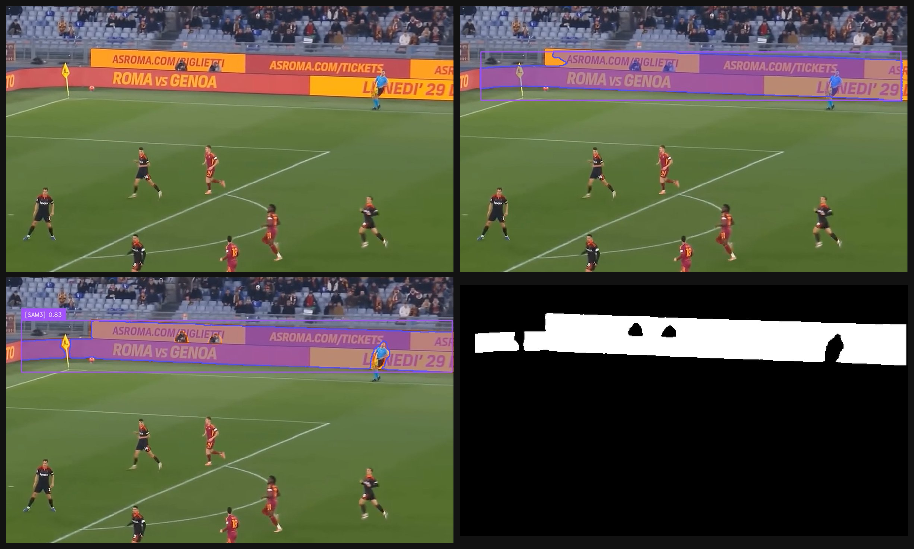

<div align="center">



# 🎯 Ad-Board Instance Segmentation
### Pipeline Ibrida YOLOv11n-seg + SAM3 per la Segmentazione di Pannelli Pubblicitari in Video Calcistici

<p align="center">
  
  
  
  
  
</p>

<p align="center">
  <b>Abballe Mirko</b> · Computer Vision – Deep Learning · Università Roma Tre · A.A. 2025/2026
</p>

---

</div>

## 📌 Panoramica

Questo progetto implementa una **pipeline ibrida di Instance Segmentation** per il rilevamento e la segmentazione automatica di pannelli pubblicitari perimetrali in trasmissioni televisive di calcio, con applicazione diretta al **Virtual Advertising** (sostituzione dinamica dei contenuti pubblicitari in post-produzione o real-time).

Il sistema combina la velocità di **YOLOv11n-seg** per la localizzazione spaziale con la precisione sub-pixel di **SAM3** (Segment Anything Model 3) per la rifinitura poligonale dei contorni, gestendo in modo nativo il tracking temporale su video senza tracker esterni.

### Sfide Affrontate

- **Piccole dimensioni** dei pannelli nelle inquadrature a campo lungo
- **Occlusioni frequenti** da parte dei giocatori durante l'azione
- **Distorsioni prospettiche** variabili con le angolazioni delle telecamere
- **Condizioni di illuminazione** dinamiche (notturne, stadio coperto, ecc.)
- **Coerenza temporale** delle maschere frame-by-frame nei video

---

## 🏗️ Architettura della Pipeline

```
Frame / Video
      │
      ▼
┌─────────────────────────────────────────────┐
│  STEP 1 — YOLOv11n-seg  (Detection + RPN)   │
│  • Bounding Box  (soglia τ = 0.4)           │
│  • Centroide maschera grezza (point prompt) │
│  • SAHI tiling 25% overlap  [solo video]    │
└──────────────────────┬──────────────────────┘
                       │
                       ▼
┌─────────────────────────────────────────────┐
│  STEP 2 — SAM3 Image Encoder                │
│  • Resize lato lungo = 768 px               │
│  • Image embedding generato 1× (shared)     │
│  • 90+ prompt testuali nello spazio latente │
└──────────────────────┬──────────────────────┘
                       │
                       ▼
┌─────────────────────────────────────────────┐
│  STEP 3 — Visual Grounding & Scoring        │
│  Score = 0.2·IoU_YOLO + 0.8·Conf_SAM3       │
│  → selezione maschera vincente per istanza  │
└──────────────────────┬──────────────────────┘
                       │
                       ▼
┌─────────────────────────────────────────────┐
│  STEP 4 — Post-processing                   │
│  • Nearest Neighbor upscaling               │
│  • AND logico con BBox YOLO + margine 15px  │
│  • Filtraggio geometrico (aspect ratio ≥2.5)│
└──────────────────────┬──────────────────────┘
                       │
                       ▼
              Maschera poligonale finale
```

> **Modalità video**: la pipeline aggiunge la selezione dell'*anchor frame*, la propagazione bidirezionale SAM3 su finestre di 60 frame e soglie di confidenza adattive per piccoli oggetti.

---

## 📊 Risultati

### Metriche di Addestramento YOLOv11n-seg

| Metrica | Fase 1 (1.6k img · 640px) | Fase 2 (8.8k img · 1024px) |
|---|---|---|
| Epoche | 100 | 80 (incrementali) |
| Box Precision | 0.951 | 0.946 |
| Mask Precision | 0.969 | 0.908 |
| Mask mAP50 | 0.990 | 0.891 |
| Box mAP50 | 0.983 | 0.931 |

La Fase 2, pur allenata su un dataset **5× più grande** e con etichette auto-generate (pseudo-labeling), mantiene un mAP50 eccellente acquisendo **robustezza globale** su scenari diversi.

### Scoring Pipeline Ibrida

Il meccanismo di scoring competitivo tra prompt garantisce la selezione della maschera ottimale per ogni istanza:

```
Score_final = 0.2 · IoU_YOLO + 0.8 · Confidence_SAM3
```

| Componente | Peso | Ruolo |
|---|---|---|
| IoU_YOLO | 0.2 | Ancoraggio geometrico — evita allucinazioni spaziali |
| Confidence_SAM3 | 0.8 | Autorità semantica — fidati del foundation model |

---

## 🗂️ Dataset

### Dataset 1 — Football Match Adboards Mask
- **1.620** frame estratti da video calcistici
- Maschere binarie PNG ad alta precisione (ground-truth pixel-wise)
- Split 80% train / 10% validation / 10% test (`random_state=42`)

### Dataset 2 — Football Advertising Banners Detection
- **8.851** immagini da contesti calcistici variati
- Annotazioni in formato JSON (convertite in poligoni YOLO)
- Alta variabilità visiva — usato per generalizzazione

---

## 🔬 Modelli

### YOLOv11n-seg

YOLOv11 è lo stato dell'arte nella real-time instance segmentation. I componenti chiave utilizzati in questo progetto:

- **Backbone C3K2**: micro-circuito di elaborazione a 5 fasi (proiezione, split CSP, bottleneck K2, concat, proiezione finale)
- **SPPF**: Spatial Pyramid Pooling che osserva i banner a scale diverse simultaneamente
- **C2PSA**: meccanismo di self-attention globale sulla griglia 20×20 per il contesto di stadio
- **FPN Neck**: feature pyramid network per il rilevamento multi-scala (P3/P4/P5)

### SAM3 (Segment Anything Model 3)

SAM3 (~848M parametri) introduce un design **decoupled detector-tracker** che integra nativamente il tracciamento nell'architettura:

- **Image Encoder (Hiera ViT)**: trasforma ogni frame in un image embedding contestualizzato
- **Text Encoder**: proietta i prompt testuali nello stesso spazio latente per visual grounding
- **Memory Bank dinamica**: conserva visual/mask embeddings e object pointers per la coerenza temporale
- **Cross-attention temporale**: lega le istanze al frame t con la memoria storica (t-1, t-2, ...)
- **Nodo di fusione**: deduplicazione tramite IoU > 0.7, arbitrato ID tra Detector e Tracker

#### Superamento di ByteTrack

| Aspetto | ByteTrack | SAM3 |
|---|---|---|
| Tracking | Filtro di Kalman + IoU bounding box | Memory Bank + firma visiva |
| Informazione visiva | Nessuna (puramente geometrico) | Visual embedding ad alta dimensione |
| Occlusioni | Vulnerabile a ID-switch | Cross-attention temporale |
| Integrazione | Modulo esterno alla pipeline | Nativo nell'architettura |
| Latenza | Aggiuntiva (post-processing) | Ridotta (architettura unificata) |

---

## ⚙️ Ottimizzazioni Video

### SAHI — Slicing Aided Hyper Inference

Per i pannelli distanti (lato opposto del campo), il frame viene suddiviso in tile con overlap 25% prima dell'inferenza YOLO. Le detection vengono ricomposte tramite **Non-Maximum Merging (NMM)** che preserva la geometria allungata dei cartelloni.

### Soglie di Confidenza Adattive

| Area relativa box | Soglia confidenza |
|---|---|
| < 0.2% del frame | 0.12 |
| 0.2 – 0.5% | 0.15 |
| 0.5 – 1.0% | 0.20 |
| 1.0 – 3.0% | 0.30 |
| ≥ 3.0% | 0.40 |

### Selezione Anchor Frame

La pipeline campiona YOLO ogni 5 frame e seleziona come ancora il frame con il maggior numero di detection, minimizzando l'impatto di occlusioni temporanee.

### Scoring Composito per Selezione Prompt (video)

```
score = 0.5 · IoU_avg + 0.3 · confidence_avg + 0.2 · coverage
```

dove `coverage` misura la capacità del prompt di attivare *tutti* i banner rilevati da YOLO — non solo il migliore.

---

## 📁 Struttura del Repository

```
├── Pipeline_segmentation_(frame+video)_(YOLO+SAHI++SAM3).ipynb
│     ├── [SETUP] Installazione dipendenze e mount Google Drive
│     ├── [SINGLE FRAME] Pipeline su singolo fotogramma
│     │     ├── Step 1: YOLOv11 detection + estrazione centroide
│     │     ├── Step 2: SAM3 image encoding (shared state)
│     │     ├── Step 3: Visual grounding competitivo (90+ prompt)
│     │     └── Step 4: Post-processing e visualizzazione
│     └── [VIDEO] Pipeline su video completo
│           ├── Estrazione frame e windowing (60 frame)
│           ├── SAHI tiling + NMM fusion
│           ├── Anchor frame selection
│           ├── SAM3 grounding + propagazione bidirezionale
│           └── Filtraggio geometrico e ricostruzione video
├── assets/
│   └── mosaic_readme.png
└── README.md
```

---

## 🚀 Quick Start

### Requisiti

```bash
# Python 3.10+, GPU NVIDIA con CUDA
pip install ultralytics sahi supervision
pip install torch torchvision
# SAM3 da Meta AI Research
git clone https://github.com/facebookresearch/sam3
cd sam3 && pip install -e .
```

### Singolo Frame

```python
from ultralytics import YOLO
# Carica il modello fine-tuned
model = YOLO("best_phase2.pt")

# Step 1: detection
results = model(frame, conf=0.4, imgsz=1024)

# Step 2-4: SAM3 visual grounding
# → vedi notebook per la pipeline completa
```

### Video

```python
# Configurazione principale nel notebook
VIDEO_PATH    = "partita.mp4"
YOLO_MODEL    = "best_phase2.pt"
SAM3_MODEL    = "sam3_hiera_large.pt"
WINDOWS_SIZE  = 60        # frame per finestra temporale
SAHI_OVERLAP  = 0.25      # overlap tile SAHI
CONF_BASE     = 0.30      # soglia base confidenza
```

> Il notebook è ottimizzato per Google Colab con GPU **NVIDIA L4** (22 GB VRAM).

---

## 📈 Dettagli Implementativi

### Pre-processing Dataset 1 (Mask → Polygon)

1. Parsing dell'ID numerico dal nome file per accoppiare frame e maschera
2. Binarizzazione e rilevamento contorni con `cv2.findContours`
3. Filtraggio poligoni con area < 10 px (rimozione artefatti)
4. Normalizzazione YOLO in coordinate relative [0, 1]

### Fine-tuning

- **Fase 1**: 100 epoche · 640px · Dataset 1 (1.620 img)
- **Fase 2**: 80 epoche (incrementali) · alta risoluzione 1024px · Dataset `football_massive` (~8.800 img) · Data augmentation: `perspective` + `close_mosaic`

### Post-processing Maschere

- **Nearest Neighbor upscaling** (da 768px → risoluzione originale) per preservare i bordi binari senza aliasing
- **AND logico** con BBox YOLO + margine di sicurezza 15px per prevenire sbordamenti su erba/giocatori
- **Filtraggio geometrico**: aspect ratio ≥ 2.5 (vicini) / ≥ 1.8 (lontani), area 0.05%–30% del frame

---

## 📚 Riferimenti

- [Ultralytics YOLOv11](https://docs.ultralytics.com/models/yolo11/)
- [Meta AI — SAM3](https://ai.meta.com/sam3/) · [GitHub](https://github.com/facebookresearch/sam3)
- [SAHI — Slicing Aided Hyper Inference](https://github.com/obss/sahi)
- [Roboflow Supervision](https://supervision.roboflow.com/)
- [Meta AI — Hiera ViT](https://github.com/facebookresearch/hiera)
- Dataset: [Football Match Adboards Mask](https://www.kaggle.com/datasets/swagatajana/football-match-adboards-mask-dataset) · [Football Advertising Banners](https://www.kaggle.com/datasets/isaienkov/football-advertising-banners-detection)

---

<div align="center">

**Abballe Mirko** · Computer Vision – Deep Learning · Università Roma Tre · 2025/2026

</div>
